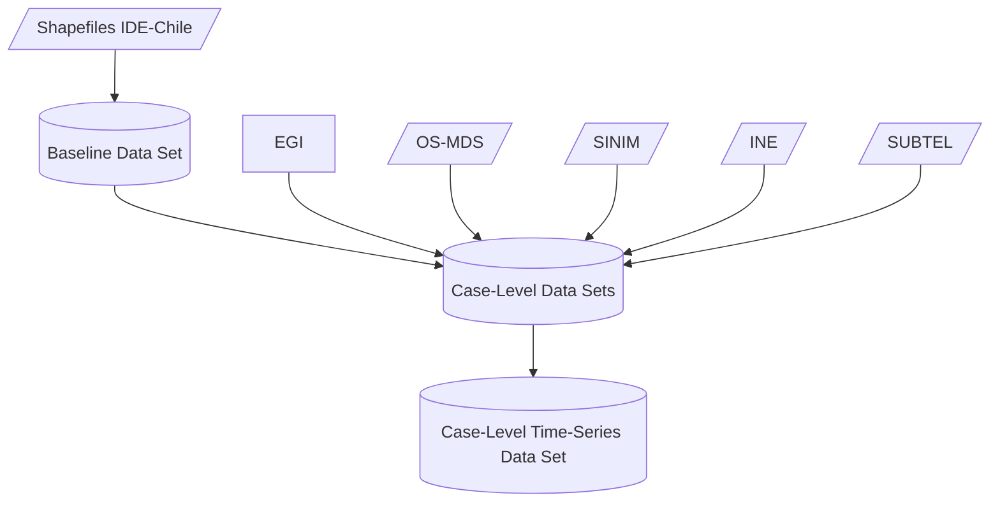

# local-gov-indicators
**Data Set on Local Government Indicators in Chile**

      

## Overview

WIP

## Data Pipeline and Coverage

### Pipeline

### Coverage

|  | EGI | OS-MDS | SINIM | INE | SUBTEL |
|---|:---:|:---:|:---:|:---:|---|
| 2010 | :x: | :x: |  |  |  |
| 2011 | :x: | :white_check_mark: |  |  |  |
| 2012 | :x: | :x: |  |  |  |
| 2013 | :x: | :white_check_mark: |  |  |  |
| 2014 | :x: | :x: |  |  |  |
| 2015 | :x: | :white_check_mark: |  |  |  |
| 2016 | :white_check_mark: | :x: |  |  |  |
| 2017 | :x: | :white_check_mark: |  |  |  |
| 2018 | :x: | :x: |  |  |  |
| 2019 | :white_check_mark: | :x: |  |  |  |
| 2020 | :x: | :white_check_mark: |  |  |  |
| 2021 | :white_check_mark: | :x: |  |  |  |

## Metadata and Preservation

This data set is stored with version control on a GitHub repository. Furthermore, a Digital Object Identifier is provided by Zenodo. The structure of the repository is detailed below.

WIP

X directories and XX files.

In addition, this README file in Markdown `MD` format provides specific information to ensure the reusability of the data.

## Storage

The GitHub repository has controlled access with Two-Factor Authentication `2FA` with two physical USB security devices (Bastián González-Bustamante, [ORCID iD 0000-0003-1510-6820](https://orcid.org/0000-0003-1510-6820)) and a mobile application (Diego Aguilar, [ORCID iD 0000-0003-4531-5922](https://orcid.org/0000-0003-4531-5922)). USB devices and the mobile application issue one-time passwords to generate a cryptographic authentication `FIDO2` and `U2F`.

## Getting Started

### Software

We use `R` version 4.1.0 (2021-05-18) -- "Camp Pontanezen".

Required `R` libraries are: WIP.

We recommend that users import the data directly using the code below or, if they wish, run exploratory data analysis code from the root directory using the `R` project `e-gov-index.Rproj`.

### Import Data

#### R Code

WIP

#### Python Code

WIP

### Replication Instructions

WIP

### Codebook

WIP

## License

This data set is released under a [Creative Commons Attribution 4.0 International license (CC BY 4.0)](LICENSE.md). This open-access license allows the data to be shared, reused, adapted as long as appropriate acknowledgement is given.

## Contribute

Contributions are entirely welcome. You just need to [open an issue](https://github.com/bgonzalezbustamante/local-gov-indicators/issues/new) with your comment or idea.

For more substantial contributions, please fork this repository and make changes. Pull requests are also welcome.

Please read our [code of conduct](CODE_OF_CONDUCT.md) first. Minor contributions will be acknowledged, and significant ones will be considered on our contributor roles taxonomy.

## Citation

González-Bustamante, B., & Aguilar, D. (2022). Data Set on Local Government Indicators in Chile (Version TBC -- TBC) [Data set]. URL: [https://github.com/bgonzalezbustamante/local-gov-indicators/](https://github.com/bgonzalezbustamante/e-gov-index/)

## Authors

Bastián González-Bustamante \
bastian.gonzalezbustamante@politics.ox.ac.uk \
[ORCID iD 0000-0003-1510-6820](https://orcid.org/0000-0003-1510-6820) \
https://bgonzalezbustamante.com

Diego Aguilar \
diego.aguilar@training-datalab.com \
[ORCID iD 0000-0003-4531-5922](https://orcid.org/0000-0003-4531-5922)

## CRediT - Contributor Roles Taxonomy

Bastián González-Bustamante ([ORCID iD 0000-0003-1510-6820](https://orcid.org/0000-0003-1510-6820)): Conceptualisation, data curation, formal analysis, funding acquisition, methodology, project administration, resources, software, supervision, and validation.

Diego Aguilar ([ORCID iD 0000-0003-4531-5922](https://orcid.org/0000-0003-4531-5922)): Conceptualisation, data curation, investigation, resources, and validation.

Berenice Orvenes (ORCID iD TBR): Investigation and resources.

Ariane Carvajal (ORCID iD TBR): Investigation and resources.

Andrea González (ORCID iD TBR): Investigation and resources.

Elinor Luco (ORCID iD TBR): Investigation.

### Latest Revision

[TBC](CHANGELOG.md).
