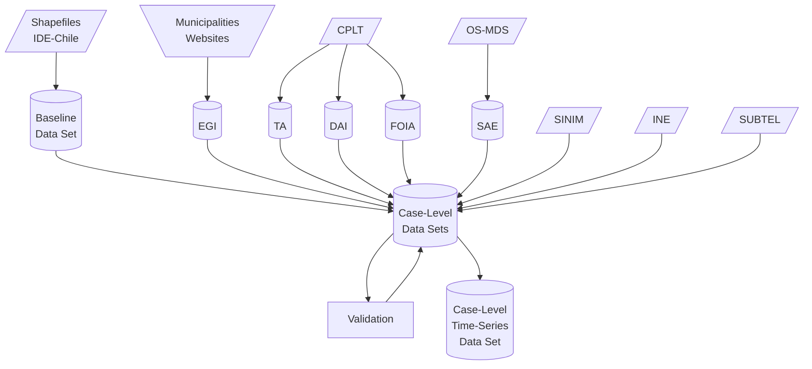

# local-gov-indicators
**Data Set on Local Government Indicators in Chile**

          

## Data Pipeline and Coverage

### Pipeline

### Coverage

|  | EGI | TA | DAI | SAE | SINIM | INE | SUBTEL |
|---|:---:|:---:|:---:|:---:|:---:|:---:|---|
| 2010 | :x: | :x: | :x: | :x: |  |  |  |
| 2011 | :x: | :x: | :x: | :white_check_mark: |  |  |  |
| 2012 | :x: | :white_check_mark: | :x: | :x: |  |  |  |
| 2013 | :x: | :white_check_mark: | :x: | :white_check_mark: |  |  |  |
| 2014 | :x: | :white_check_mark: | :white_check_mark: | :x: |  |  |  |
| 2015 | :x: | :white_check_mark: | :white_check_mark: | :white_check_mark: |  |  |  |
| 2016 | :white_check_mark: | :white_check_mark: | :white_check_mark: | :x: |  |  |  |
| 2017 | :x: | :white_check_mark: | :white_check_mark: | :white_check_mark: |  |  |  |
| 2018 | :x: | :x: | :white_check_mark: | :x: |  |  |  |
| 2019 | :white_check_mark: | :x: | :x: | :x: |  |  |  |
| 2020 | :x: | :x: | :x: | :white_check_mark: |  |  |  |
| 2021 | :white_check_mark: | :x: | :x: | :x: |  |  |  |

## Preservation

This data set is stored with version control on a GitHub repository. Furthermore, a Digital Object Identifier is provided by Zenodo.

## Storage and Backup

The GitHub repository has controlled access with Two-Factor Authentication `2FA` with two physical USB security devices (Bastián González-Bustamante, [ORCID iD 0000-0003-1510-6820](https://orcid.org/0000-0003-1510-6820)) and a mobile application (Diego Aguilar, [ORCID iD 0000-0003-4531-5922](https://orcid.org/0000-0003-4531-5922)). USB devices and the mobile application issue one-time passwords to generate a cryptographic authentication `FIDO2` and `U2F`.

Moreover, the repository is backed up on Hierarchical File Server `HFS` for recovery in case of incidents. This backup is located on the University of Oxford hub connected to `Code42` Cloud Backup encrypted with `256-bit AES`. The backup is performed with every change on GitHub and receives weekly light maintenance and a deep one every month. This backup will be secured until May 2024. An extension of this period will be evaluated on budget availability.

## Getting Started

### Software

We use `R` version 4.1.0 (2021-05-18) -- "Camp Pontanezen".

## License

The content of this project itself is licensed under a [Creative Commons Attribution 4.0 International license (CC BY 4.0)](LICENSE-CC.md), and the underlying code used to format and display that content is licensed under a [GNU GPLv3 license](LICENSE-GPL.md). In particular, the codebook will be compiled with XeLaTeX using a code licensed under an [LPPL v1.3c license](LICENSE-LPPL.md).

The above implies that the data sets may be shared, reused, and adapted as long as appropriate acknowledgement is given. In addition, the code may be shared, reused, and adapted as long as the source is disclosed, the changes are stated, and the same [GNU GPLv3 license](LICENSE-GPL.md) is used.

## Contribute

Contributions are entirely welcome. You just need to [open an issue](https://github.com/bgonzalezbustamante/local-gov-indicators/issues/new) with your comment or idea.

For more substantial contributions, please fork this repository and make changes. Pull requests are also welcome.

Please read our [code of conduct](CODE_OF_CONDUCT.md) first. Minor contributions will be acknowledged, and significant ones will be considered on our contributor roles taxonomy.

## Citation

González-Bustamante, B., & Aguilar, D. (2023). Data Set on Local Government Indicators in Chile (Version 0.21.14 -- Old Waterfall) [Data set]. DOI: [10.5281/zenodo.6848053](https://doi.org/10.5281/zenodo.6848053)

## Authors

Bastián González-Bustamante \
bastian.gonzalezbustamante@politics.ox.ac.uk \
[ORCID iD 0000-0003-1510-6820](https://orcid.org/0000-0003-1510-6820) \
https://bgonzalezbustamante.com

Diego Aguilar \
diego.aguilar@training-datalab.com \
[ORCID iD 0000-0003-4531-5922](https://orcid.org/0000-0003-4531-5922)

## CRediT - Contributor Roles Taxonomy

Bastián González-Bustamante ([ORCID iD 0000-0003-1510-6820](https://orcid.org/0000-0003-1510-6820)): Conceptualisation, data curation, formal analysis, funding acquisition, methodology, project administration, resources, software, supervision, and validation.

Diego Aguilar ([ORCID iD 0000-0003-4531-5922](https://orcid.org/0000-0003-4531-5922)): Conceptualisation, data curation, investigation, resources, and validation.

Berenice Orvenes ([OSF osf.io/37keu](https://osf.io/37keu/)): Investigation and resources.

Ariane Carvajal ([ORCID iD 0000-0002-6181-7458](https://orcid.org/0000-0002-6181-7458)): Investigation and resources.

Andrea González ([ORCID iD 0000-0002-6822-0056](https://orcid.org/0000-0002-6822-0056)): Investigation and resources.

Elinor Luco ([ORCID iD 0000-0003-3370-4322](https://orcid.org/0000-0003-3370-4322)): Investigation.

### Latest Revision

[January 25, 2023](CHANGELOG.md).
